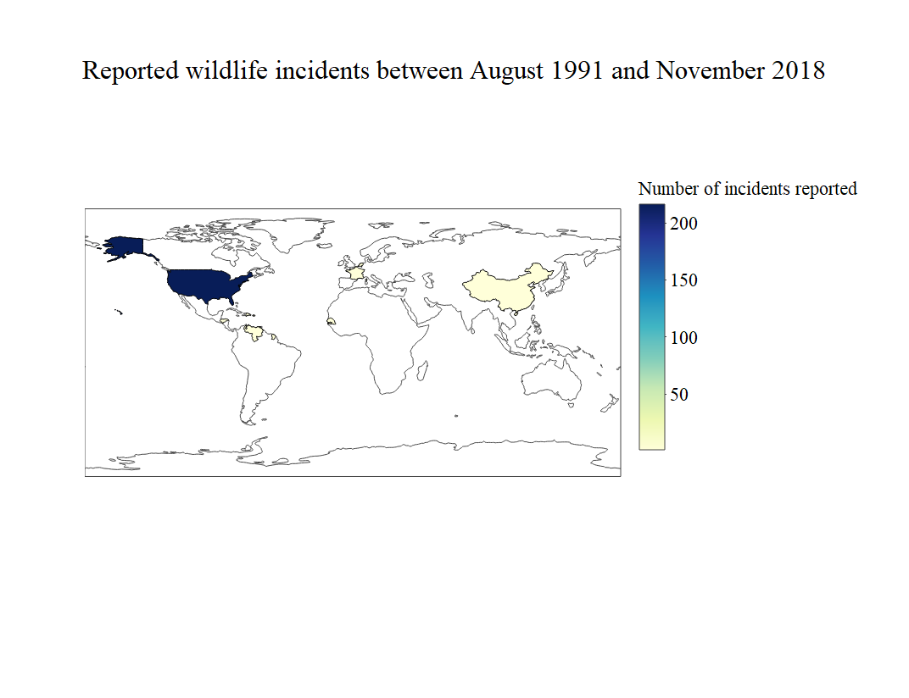
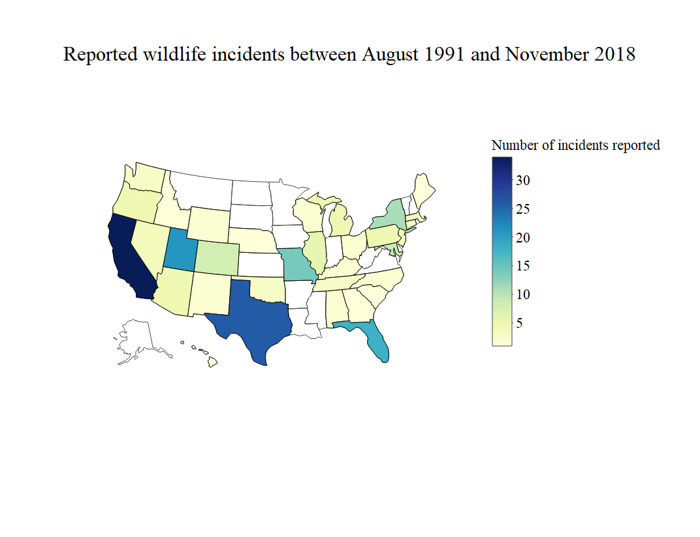

# tidy-tuesday wildlife incidents

A quick map visualisation using Plotly library together with tidyverse tools. Took less than an hour, so more of a "fun Saturday morning"

Data by tidytuesday didn't contain everything I wanted, so I found more information about the airports using [Open Flights data](ttps://openflights.org/data.html#license).

There seems to be unreasonably few incident reports outside of US, so makes sense to single US out:

This is using the following libraries:

- tidyverse
- plotly
- magrittr
- countrycode
- processx
- glue
